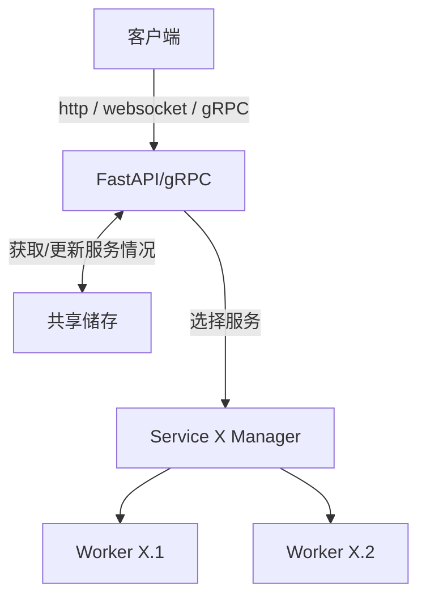

# 简介
ThinkServe是基于FastAPI/Pydantic的一个类似k8s/grpc的微服务框架, 旨在实现:
1. 打包/部署/管理等一系列服务生命周期的功能，自动根据情况进行扩容/缩容/重启等操作.
2. 容器化: service可以是不同版本的python, 甚至是js/docker等其他服务, 容器可以从一个thinkserve服务器传输到另一个thinkserve服务器并进行部署. service可被隔离在独立环境中, 限制资源使用及权限, 提高安全性和稳定性.
3. 统一管理面板UI, 方便监控/注册服务/查看日志/配置环境变量等操作. 支持Service自定义测试界面/接口, 以便快速验证服务功能.
4. batch功能: 支持等待n个input/delay某个时间后再批量进行处理, 适合AI等场景.
5. 负载均衡: 自动平衡同一个category下的多个service实例的请求, 且提供可细致选择节点的filter, 例如指定某个category服务时的优先度及故障转移策略.
6. 统一接口: service透过实现方法来提供功能, 这些功能会被thinkserve透过http/gRPC/websocket等协议暴露.
7. 请求体约束: service的方法的输入输出参数会被thinkserve自动转换成pydantic模型, 自动利用方法的comment/type hint等信息进行参数校验/文档生成等功能.
8. 临时文件/媒体: 对于请求体中的超大文件, 支持先上传, 然后thinkserve返回一个id填入那个原本在json内的media/file field.
9. 集群集成: 设置thinkserve之间的信任关系, 使得它们可以互相调用对方的服务, 或管理对方的服务, 以实现更大规模的分布式部署.

# 架构

其中共享储存是透过一个单独的Process(Python multiprocessing.Manager)来实现的.

# 项目文件结构
- thinkserve:
  - serve: thinkserve框架自身相关的代码, 例如fastapi接口
  - data_types: thinkserve框架额外的数据类型, 例如Image/Audio/Video/File等, 用作service方法的输入输出参数.
  - service: 自定义service的底层, 你需要继承`Service`类来实现服务逻辑
  - utils: 一些共用的工具函数.
  - client: 便于调用thinkserve服务的客户端库, 快速建立符合协议的调用(你也可以直接http/gRPC/websocket自行发送)

# 自定义服务例子:
```python

```